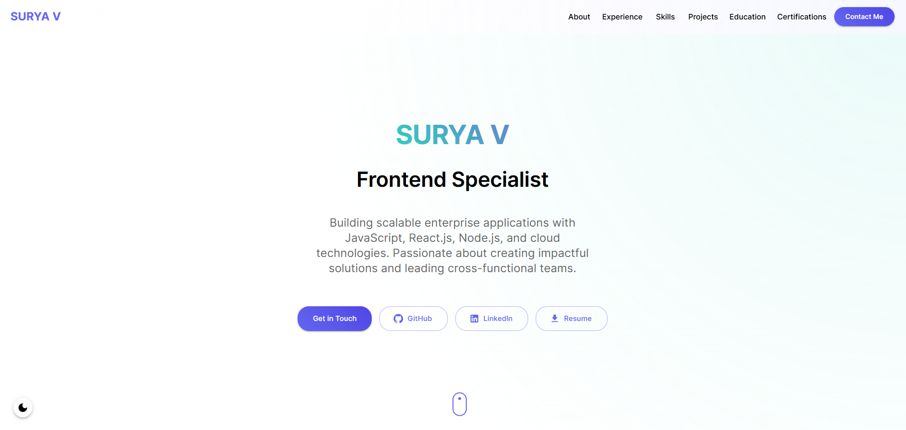

# Modern Portfolio Website

A sleek, responsive portfolio website built with modern web technologies, featuring a beautiful glass-morphism design, smooth animations, and dark/light theme support. View the live site at [https://suryavardhan28.github.io/portfolio/](https://suryavardhan28.github.io/portfolio/)



## 🌟 Features

-   **Responsive Design**: Fully responsive layout that looks great on all devices
-   **Theme Switching**: Elegant dark/light theme with smooth transitions
-   **Modern UI**: Glass-morphism design inspired by Continue.dev
-   **Smooth Animations**: Page sections animate on scroll using Framer Motion
-   **Interactive Elements**: Mouse-following highlights and hover effects
-   **Dynamic Content**: Auto-rotating role titles in hero section
-   **Resume Download**: Direct PDF download option
-   **Optimized Performance**: Fast loading and smooth scrolling
-   **Accessibility**: Semantic HTML and ARIA attributes

## 🛠️ Technologies

-   **Frontend Framework**: React 19.1
-   **Build Tool**: Vite 7.1
-   **Language**: TypeScript
-   **UI Framework**: Material-UI (MUI) 5.15
-   **Animations**: Framer Motion 11.0
-   **Package Manager**: Bun
-   **Deployment**: GitHub Pages
-   **Version Control**: Git

## 🚀 Getting Started

### Prerequisites

-   [Bun](https://bun.sh/) (Latest version)
-   Node.js 18+ (for certain dev tools)

### Installation

1. Clone the repository:

    ```bash
    git clone https://github.com/Suryavardhan28/portfolio.git
    cd portfolio
    ```

2. Install dependencies:

    ```bash
    bun install
    ```

3. Start the development server:

    ```bash
    bun run dev
    ```

4. Open [http://localhost:5173](http://localhost:5173) in your browser

### Building for Production

```bash
bun run build
```

### Deployment

The site is automatically deployed to GitHub Pages when pushing to the main branch:

```bash
bun run deploy
```

## 📁 Project Structure

```
portfolio/
├── public/              # Static files
│   ├── resume.pdf      # Downloadable resume
│   └── logo.svg        # Site logo
├── src/
│   ├── components/     # React components
│   │   ├── common/     # Shared components
│   │   └── sections/   # Page sections
│   ├── theme/          # MUI theme configuration
│   ├── hooks/          # Custom React hooks
│   ├── assets/         # Images and other assets
│   └── App.tsx         # Main application component
├── index.html          # Entry HTML file
└── vite.config.ts      # Vite configuration
```

## 🎨 Customization

### Themes

The site uses a custom Material-UI theme with two modes:

-   **Light Theme**: Glass-morphism design with white backgrounds and subtle gradients
-   **Dark Theme**: Rich dark backgrounds with vibrant accent colors

Theme configuration is in `src/theme/theme.ts`.

### Animations

-   Section animations trigger on scroll using Framer Motion
-   Interactive hover effects on cards and buttons
-   Smooth transitions for theme switching
-   Auto-rotating text in hero section

## 📱 Responsive Design

The site is fully responsive with breakpoints at:

-   Mobile: < 600px
-   Tablet: 600px - 900px
-   Desktop: > 900px

## 🔧 Development

### Code Style

-   TypeScript for type safety
-   ESLint for code quality
-   Prettier for code formatting

### Performance Optimization

-   Optimized animations using Framer Motion's best practices
-   Efficient scroll-based animations with IntersectionObserver
-   Minified and optimized production build with Vite
-   Responsive image and asset optimization

## 👤 Author

**Surya V**

-   GitHub: [@Suryavardhan28](https://github.com/Suryavardhan28)
-   LinkedIn: [Surya Vardhan](https://www.linkedin.com/in/surya-vardhan-28102000/)
